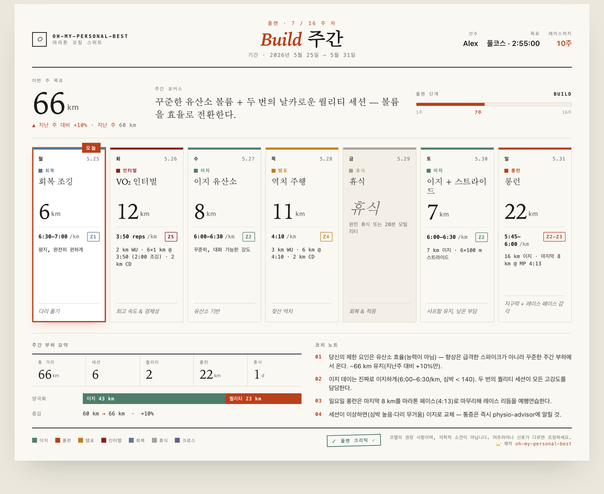
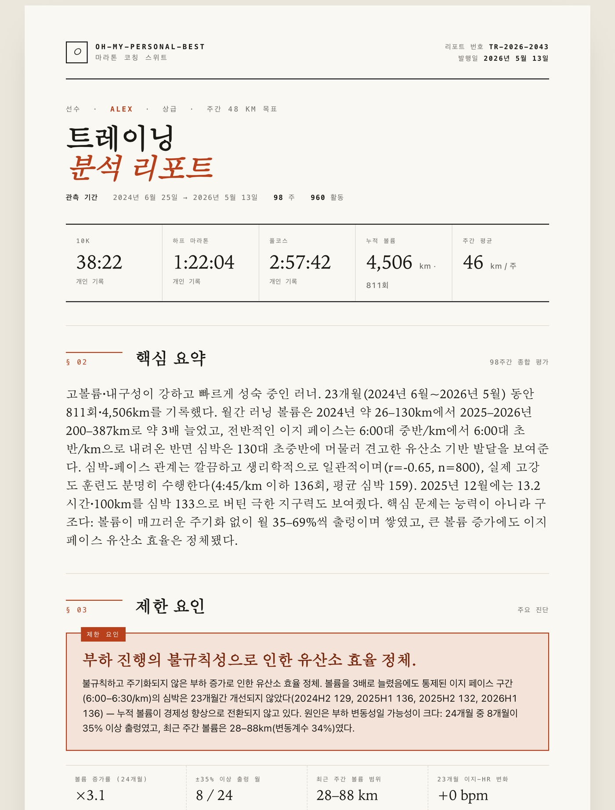
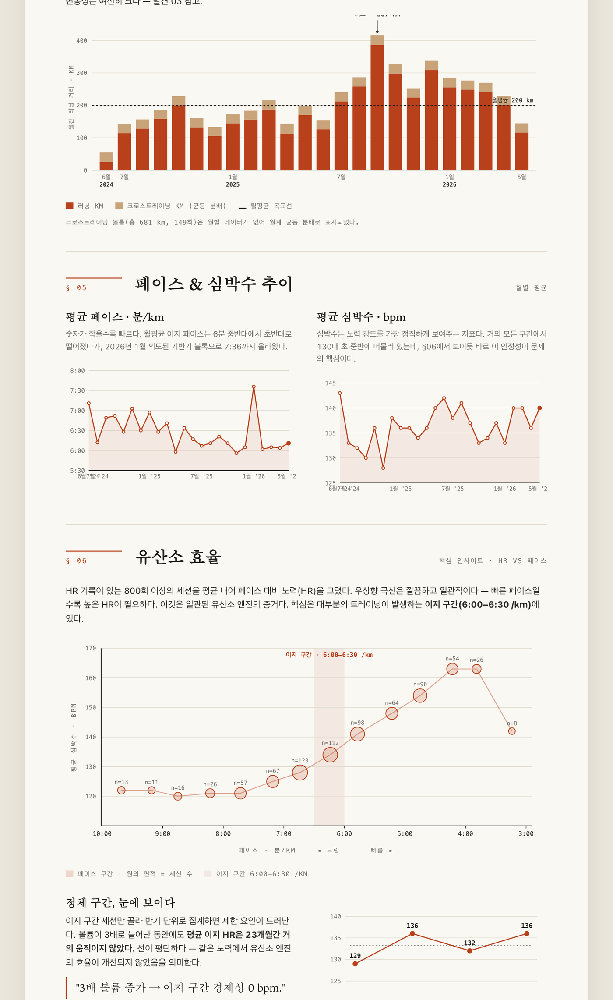

[English](README.md) | 한국어

# oh-my-personal-best

[](https://github.com/seungwee-choi/oh-my-personal-best/releases)
[](https://github.com/seungwee-choi/oh-my-personal-best/blob/main/LICENSE)
[](https://docs.anthropic.com/claude-code)

**수천 km를 달렸습니다. 그 데이터는 당신이 왜 더 빨라지지 않는지 이미 알고 있습니다 — 당신만 못 볼 뿐.**

_그 모든 기록을 드디어 읽어내는 AI 코치 — 당신의 단 하나의 약점을 찾고, 계획을 짜고, 부상으로 이어지지 않게 막습니다._

[시작하기](#빠른-시작) • [실제 화면](#실제-화면) • [동작 원리](#동작-원리) • [왜 그냥-ai에-안-묻고](#왜-그냥-ai에-안-묻고) • [로드맵](#로드맵)

<p align="center">
  
  <br>
  <em>당신의 한 주를 인쇄용 카드로 — 모든 세션의 페이스·심박 존·구성·목적·코치 노트까지. <code>/pb-week</code>로 생성합니다.</em>
</p>

Garmin·COROS·Strava에는 당신이 볼 수 없는 답이 가득합니다 — 손으로는 평생 분석 못 할 수천 줄 아래 묻혀서. **oh-my-personal-best**는 당신의 *전체* 훈련 히스토리 — 모든 페이스, 심박 드리프트, 정체 구간 — 를 읽어 당신을 붙잡는 단 하나의 제한 요인을 짚고, 그 주위로 주기화된 계획을 만듭니다. 월 20만 원짜리 코치가 해주는 엘리트급 분석을, 당신의 터미널에서. **쌓아둔 데이터를 묵혀두지 마세요.**

---

## 빠른 시작

**Step 1: 설치**

Claude Code 슬래시 커맨드입니다 — **한 줄씩** 입력하세요:

```bash
/plugin marketplace add https://github.com/seungwee-choi/oh-my-personal-best
```

다음:

```bash
/plugin install oh-my-personal-best
```

**Step 2: `/pb-setup` 실행**

설치 후 `/pb-setup`을 실행하세요 (COROS/Garmin export 파일이나 CSV 경로를 선택적으로 전달할 수 있습니다):

```
/pb-setup
/pb-setup /path/to/coros-export.zip
```

`/pb-setup`은 데이터 디렉토리(OMPB_HOME, 기본값 `~/.ompb`)를 확인하고, 의존성을 점검하며, 기존 활동 데이터를 임포트해 러너 프로필과 PB 이력을 초기화합니다. 이어서 초기 체력 진단을 실행하고 첫 번째 분석 리포트를 만들어 줍니다 — 지금 상태를 한눈에 파악하고 시작할 수 있습니다. 셋업이 완료되면 일상 루프는 `/pb-today`, `/pb-log`, `/pb-report`, `/pb-plan`입니다.

---

**Step 3: 목표를 말하세요**

설정 양식 없습니다. 그냥 자연어로 원하는 걸 말하면 됩니다:

```
"풀코스 sub-3:30 만들고 싶어"
"10K 50분인데 45분 가고 싶어, 16주 남음"
```

처음이라면 OMPB가 최소한의 정보(최근 레이스 또는 현재 PB, 주간 마일리지, 목표, 대회 날짜)만 먼저 물어본 뒤 계획을 만듭니다.

**Step 4: 한 주를 돌리세요**

```
"오늘 뭐 뛰어?"
"12km 이지로 뛰었어, 평균 심박 142"
"이번 주 계획 조정해줘"
```

끝입니다. 모든 말이 알맞은 전문가에게 자동으로 라우팅됩니다.

### 어디서 시작해야 할지 모르겠다면?

지금 상태와 가고 싶은 곳만 말하세요 — _"하프 첫 도전, 10K는 55분, 12주 남음."_ OMPB가 현재 체력을 진단하고, 목표가 현실적인지 판단한 뒤, 그 격차를 메우는 계획을 만듭니다. 템포런이나 테이퍼가 뭔지 몰라도 됩니다.

---

## 실제 화면

OMPB는 당신의 원시 활동 기록을 "지금 어디에 있고, 다음에 뭘 해야 하는지"에 대한 코치의 판독으로 바꿉니다.

**당신의 데이터로 만든 완전한 훈련 분석** — `/pb-report`

<p align="center"></p>

**전체** 로그를 읽고(여기선 96주에 걸친 960개 활동 / 4,506km), 체력을 추정하며, 당신의 **1순위 제한 요인**을 짚어냅니다 — 일반론이 아니라, *당신을* 붙잡고 있는 바로 그것.

<p align="center"></p>

볼륨 주기화, 페이스 대비 심박 드리프트, 그리고 정체 구간을 *눈에 보이게* 만드는 유산소 효율 플롯 — 모두 인라인 SVG, 완전 self-contained, 인쇄·PDF 준비 완료.

> 스크린샷은 실제 23개월 훈련 기록을 사용했습니다(익명화).

---

## 왜 oh-my-personal-best인가?

- **당신이 달린 모든 것을 읽습니다** — 지난주 평균이 아니라. 수천 개의 활동, 체력의 전체 궤적 — 어떤 인간 코치도 다 읽을 시간이 없는 맥락까지.
- **당신을 붙잡는 단 하나를 찾습니다** — 유산소 기반? 역치? 내구성? 대부분의 러너는 강점만 훈련하다 멈춥니다. OMPB는 당신의 제한 요인을 짚어 그것을 공략합니다.
- **진짜 당신만의 계획** — 목표와 실제 데이터로부터 역산합니다. 당신이 작년에 900번 달린 걸 모르는 일반 sub-3:30 PDF가 아니라.
- **부상으로 몰지 않습니다** — 모든 계획은 당신이 보기 전 별도의 안전 게이트를 통과합니다. 위험한 볼륨 증가, 뭉개진 테이퍼는 절대 도달하지 않습니다. Self-approve는 결코 없습니다.
- **멈춰야 할 때를 압니다** — 통증 한마디면 계획이 물러섭니다. 코치이지, 의사가 아닙니다.
- **학습 곡선 제로** — 용어도, 명령어도, 해독할 대시보드도 없습니다. 평소 말로 던지면 알맞은 전문가가 답합니다.

---

## 왜 그냥 AI에 안 묻고?

매주 데이터를 챗봇에 붙여넣을 수도 있습니다. 하지만 목적에 맞게 설계된 코칭 시스템은 빈 채팅창 — 또는 워치 앱 — 이 못 하는 일을 합니다:

| | 일반 AI 채팅 | 워치 앱 (Garmin/COROS/…) | **oh-my-personal-best** |
|---|:---:|:---:|:---:|
| **전체** 훈련 기록을 읽음 | ✗ 매번 다시 붙여넣기 | ◑ 데이터는 보여주나 일반 계획 | ✅ 전체 로그를 읽음 |
| **당신의** 제한 요인 진단 | ◑ 일반적 조언 | ✗ | ✅ `race-analyst` |
| **모든 계획 전** 안전 게이트 | ✗ | ✗ | ✅ `plan-critic` |
| 아플 때 멈춰 세움 | ◑ 일관성 없음 | ✗ | ✅ `physio-advisor` 우선 |
| **실제 뛴 것**에 맞춰 매주 적응 | ✗ 수동 | ◑ 경직된 템플릿 | ✅ `weekly-adapt` |
| 데이터가 있는 곳 | 그들의 서버 | 기기 종속 | ✅ 로컬, 당신의 Claude Code 안 |

게이트 레인이 차이입니다: 위험한 볼륨 증가나 부족한 테이퍼가 담긴 계획은 **절대 당신에게 도달하지 않습니다.** Self-approve 없음.

---

## 동작 원리

4개 레인에 걸친 8명의 전문가 에이전트. 사용자가 에이전트를 고르지 않습니다 — OMPB가 말에 따라 라우팅합니다.

### 8명의 에이전트

| 레인 | 에이전트 | 모델 | 역할 |
|---|---|---|---|
| **진단** | `race-analyst` | Opus | PB / GPS / HR 기반 체력 진단 — 당신의 #1 약점을 특정 |
| **진단** | `data-logger` | Haiku | 세션 기록, CSV 업로드와 자연어 보고를 정규화 |
| **계획** | `plan-architect` | Opus | 주기화 설계: Base → Build → Peak → Taper |
| **계획** | `session-coach` | Sonnet | 구체적 일일 세션 처방 — 인터벌·템포·롱런 |
| **계획** | `pace-strategist` | Sonnet | 레이스 스플릿, 페이스 전략, 플랜 B |
| **지원** | `physio-advisor` | Sonnet | 부상 예방, 회복, 통증 신호 안전 게이트 |
| **지원** | `fuel-advisor` | Sonnet | 영양, 카보로딩, 레이스 연료 스케줄 |
| **게이트** | `plan-critic` | Opus | 생리학적 품질 게이트 — 승인 없이는 어떤 계획도 노출되지 않음 |

### 스킬

워크플로우가 훈련 전 주기를 커버합니다:

| 스킬 | 하는 일 |
|---|---|
| `race-plan` | 목표 → 완성 계획 한 번에: 진단 → 주기화 → 세션 채움 → 게이트 → 전달 |
| `weekly-adapt` | 주간 적응 루프: 실제 로그 → 피로 평가 → 다음 주 조정 → 게이트 |
| `race-week` | 레이스 직전 병렬 협의: 페이스 + 연료 + 피지오 동시 → 하나의 레이스데이 브리프 |
| `pb-week` | 이번 주 플랜을 시각적·인쇄용 카드로 (일간 `/pb-today`·블록 `/pb-plan`의 주간 짝) |
| `pb-report` | 분석 → 인쇄·PDF용 종합 리포트 문서 (인라인 SVG 차트, self-contained) |

---

## 세션 내 단축 명령

쓸 필요 없습니다 — 자연어만으로 충분합니다. 하지만 명시적 명령을 선호한다면 얇은 디스패처가 준비돼 있습니다:

| 커맨드 | 라우팅 | 효과 |
|---|---|---|
| `/pb-setup [경로]` | `pb-setup` 스킬 | 첫 실행 온보딩: 데이터 임포트, 프로필 초기화, 초기 리포트 생성 |
| `/pb-plan "16주 sub-3:30 풀코스"` | `race-plan` 스킬 | 완성된 주기화 훈련 계획 생성 |
| `/pb-today` | `session-coach` | 오늘 세션 받기 |
| `/pb-week` | `pb-week` 스킬 | 이번 주 훈련표를 시각적 카드로 보기 |
| `/pb-log <경로 또는 텍스트>` | `data-logger` | 기록 입력 (.fit/.zip/CSV 파일, 또는 자연어) |
| `/pb-report` | `pb-report` 스킬 | 인쇄·PDF용 종합 훈련 리포트 생성 |
| `/pb-connect-strava` | `pb-connect-strava` 스킬 | Strava 연동 (최초 1회) 및 활동 동기화 |

| 이렇게 말하면 (예시) | 라우팅 |
|---|---|
| "풀코스 sub-3:30" / "훈련 계획" / 목표 기록 | `race-plan` (진단 → 주기화 → 게이트 → 전달) |
| "오늘 뭐 뛰어?" | `session-coach` |
| "무릎이 아픈데 롱런 해도 돼?" | `physio-advisor` (안전 게이트 우선) |
| "레이스 3일 전인데 뭐 먹어?" | `fuel-advisor` + `pace-strategist` |
| "지난주 기록 어땠어?" / "12km 이지 뛰었어" | `data-logger` |
| "이번 주 계획 조정해줘" | `weekly-adapt` |
| "다음 주가 대회야" / "테이퍼" | `race-week` (병렬 협의) |

---

## 데이터 입력

모든 경로가 동일한 `training-log.jsonl` 스키마로 정규화됩니다. 어떤 경로인지 신경 쓸 필요 없습니다 — `data-logger`가 라우팅을 처리합니다.

**현재 사용 가능**
- **기기 파일 (`.fit`)** — COROS / Garmin export 폴더·개별 파일·`.zip`을 `scripts/import_fit.py`로 파싱. 러닝은 거리로 easy/long 분류, 그 외 종목(사이클·수영 등)은 `cross`로 적재해 총 훈련 부하를 포착. 재임포트는 활동 ID로 중복 제거. `fitdecode` 필요 (`requirements.txt` 참고).
- **CSV 업로드** — Strava 활동 export를 `scripts/import_csv.py`로 파싱 (표준 라이브러리만 사용)
- **자연어** — "12km 이지로 5:30에 뛰었어" → 파싱 후 적재
- **Strava API** — `/pb-connect-strava`로 최초 1회 연동 (본인 Strava 앱 + localhost OAuth); `import_strava.py`가 액세스 토큰을 자동 갱신하고 모든 활동을 동기화합니다. 인증 정보는 `~/.ompb/strava.json`에 저장됩니다 (chmod 600, 절대 커밋하지 마세요).

**Garmin / COROS**
- 이들은 **개인용 API가 없습니다** — Garmin·COROS 개발자 프로그램은 기업/파트너 전용이라 개인이 per-user OAuth를 쓸 수 없습니다. 대신 위의 두 경로를 쓰세요: `.fit`을 export 해서 `/pb-log` 하거나, **워치의 Strava 자동 연동**(Garmin/COROS 앱에서 토글 하나)을 켠 뒤 `/pb-connect-strava` 실행 — Garmin/COROS 활동이 Strava를 거쳐 들어옵니다. 분석 에이전트는 통합 로그만 읽으므로 출처는 무관합니다.

---

## 상태

모든 것은 OMPB_HOME (`~/.ompb` 기본값) 아래 지속됩니다:

| 파일 | 내용 |
|---|---|
| `runner-profile.json` | 나이, 성별, 현재 PB(10K / Half / Full), 주간 마일리지, 부상 이력 |
| `goal.json` | 목표 종목, 목표 기록, 대회 날짜, 남은 주차 |
| `training-log.jsonl` | 추가 전용 일일 세션 — 계획 vs 실제: 거리, 페이스, 심박, RPE |
| `pb-history.json` | 대회 날짜가 포함된 PB 타임라인 |
| `plan-state.json` | 현재 단계, 주차, 이번 주 목표 적재량, `critic_approved` 플래그 |

`plan-state.json`의 `critic_approved`가 `true`여야만 계획이 노출됩니다. `plan-critic`만 이 값을 설정할 수 있습니다.

---

## 안전

- **통증, 부상, 또는 신체 증상** → `physio-advisor`가 즉시 인계받습니다. GREEN 또는 YELLOW 클리어런스가 나올 때까지 훈련 처방은 억제됩니다.
- **RED 판정** → 모든 계획 생성이 중단되고, OMPB가 스포츠 의학 검진을 권고합니다. 레이스 일정은 러너의 안전에 종속됩니다.
- **점진적 과부하** → 주간 적재량 증가는 ~10%/주로 제한됩니다. `plan-critic`이 이를 위반하는 계획을 반려합니다.
- **코치이지 의사가 아님** → OMPB는 코칭 시스템입니다. 의학적 진단이나 약물 처방을 하지 않습니다. 의심되면 스포츠 의학 전문가를 찾으세요.

---

## 비범위

OMPB가 하지 않는 것: 의학적 진단·치료, 엘리트 선수를 위한 공인 코치 대체, 비러닝 종목 주기화 관리, 특정 완주 기록 보장.

---

## 로드맵

**현재 제공**
- ✅ 임포트: `.fit`(COROS/Garmin), CSV, 자연어, Strava 동기화(토큰 자동 갱신)
- ✅ 체력 진단, 주기화 계획(Base → Build → Peak → Taper) + 필수 안전 게이트
- ✅ 주간 적응, 레이스위크 브리프, 인쇄·PDF 리포트, 주간 플랜 카드
- ✅ 영어 / 한국어 (`config.json` `language`)

**예정**
- ⏳ Garmin / COROS 직접 연동 (현재는 Strava 브리지를 거쳐 들어옴)
- ⏳ 단위 토글(km / mi) 및 타임존 (`config.json`)
- ⏳ 멀티 레이스 시즌 계획
- ⏳ 추가 언어

요청이 있으신가요? [이슈를 남겨주세요](https://github.com/seungwee-choi/oh-my-personal-best/issues).

---

## 요구사항

- [Claude Code](https://docs.anthropic.com/claude-code) CLI
- Claude Max/Pro 구독 또는 Anthropic API 키
- Python 3 (표준 라이브러리) — `.fit` 임포트에만 `fitdecode` 필요 (`pip install -r requirements.txt`)

---

## 기여

이슈와 PR을 환영합니다.

- 🐛 **버그를 찾았거나 아이디어가 있나요?** [이슈를 남겨주세요](https://github.com/seungwee-choi/oh-my-personal-best/issues).
- 🔧 **직접 손대보고 싶다면?** 이 플러그인은 순수 Markdown(에이전트 + 스킬)과 표준 라이브러리 Python(`scripts/`)으로 되어 있습니다. 의존성이 필요한 건 `.fit` 임포트뿐입니다(`pip install -r requirements.txt`).
- 📐 상태 스키마는 [`docs/STATE-SCHEMA.md`](docs/STATE-SCHEMA.md), 자연어 라우팅은 [`CLAUDE.md`](CLAUDE.md)에 있습니다.

OMPB가 당신의 훈련에 도움이 됐다면, ⭐ 하나가 다른 러너들이 이걸 찾는 데 도움이 됩니다.

---

## Star History

<a href="https://star-history.com/#seungwee-choi/oh-my-personal-best&Date">
  
</a>

---

## 라이선스

MIT

---

<div align="center">

**당신의 데이터는 이미 당신의 다음 PB를 알고 있습니다. 묵혀두지 마세요.**

</div>
