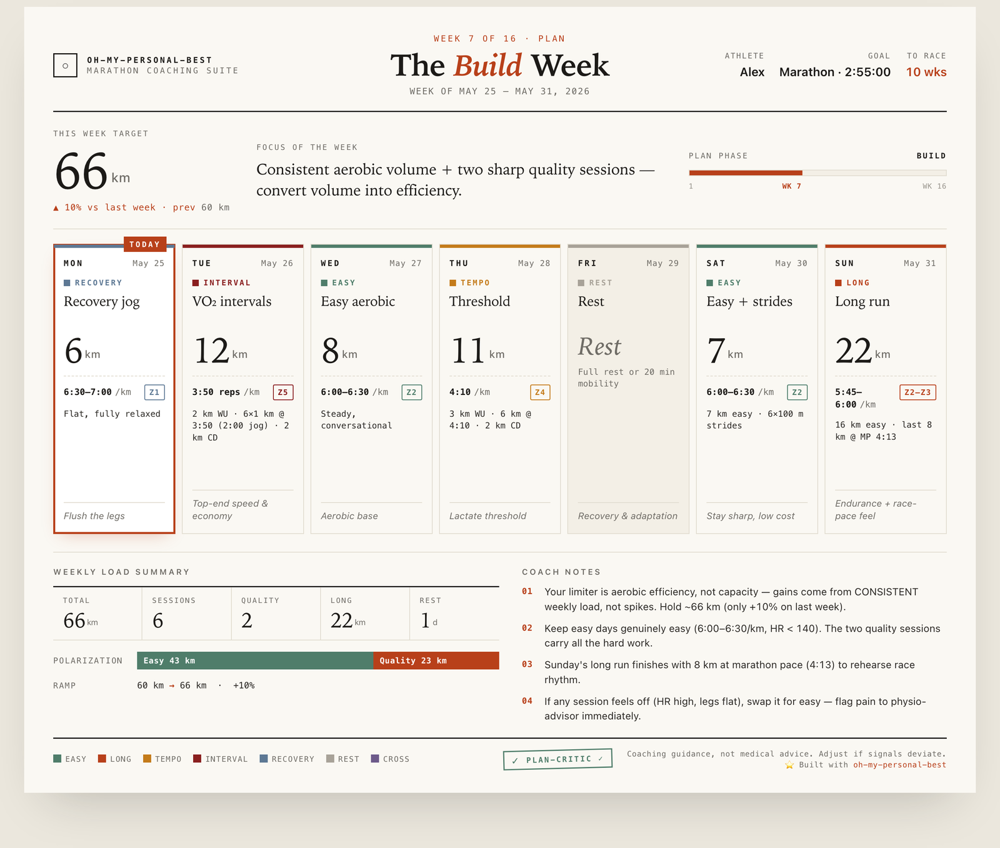
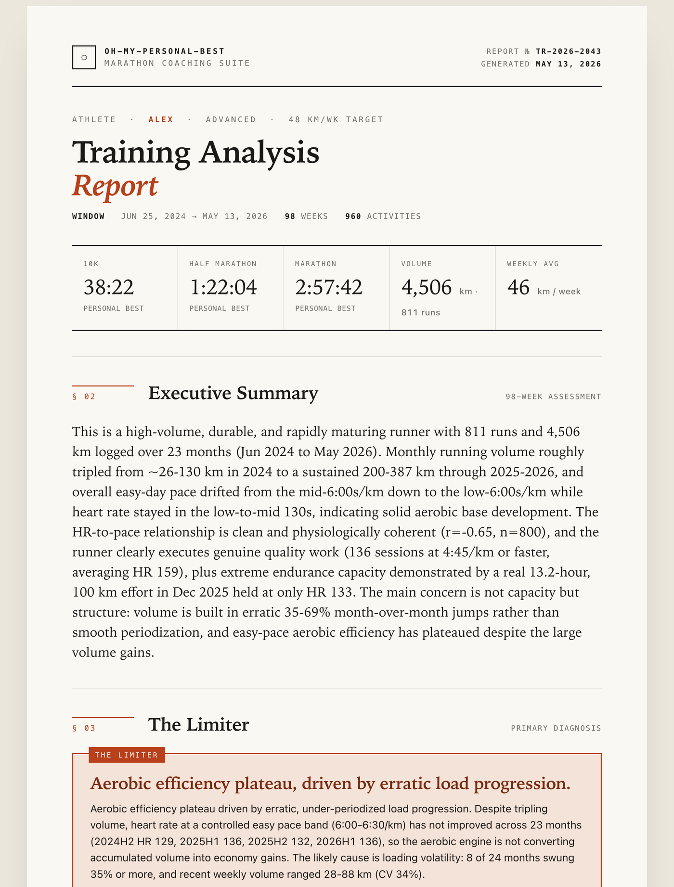
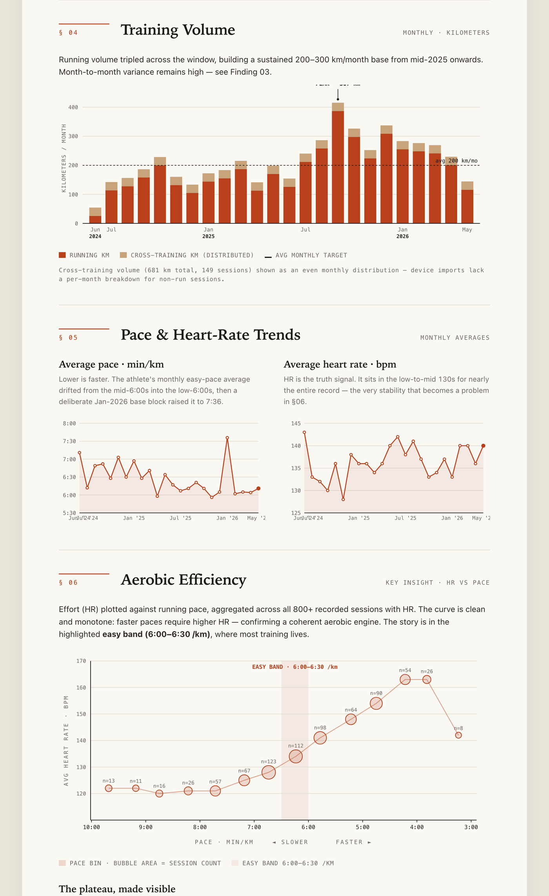

English | [한국어](README.ko.md)

# oh-my-personal-best

[](https://github.com/seungwee-choi/oh-my-personal-best/releases)
[](https://github.com/seungwee-choi/oh-my-personal-best/blob/main/LICENSE)
[](https://docs.anthropic.com/claude-code)

**You've logged thousands of kilometers. That data already knows the one reason you're not getting faster — you just can't see it.**

_An AI coach that finally reads all of it — finds your limiter, builds the plan, and won't let it injure you._

[Get Started](#quick-start) • [See It in Action](#see-it-in-action) • [How It Works](#how-it-works) • [Why Not Just Ask an AI?](#why-not-just-ask-an-ai) • [Roadmap](#roadmap)

<p align="center">
  
  <br>
  <em>Your week, rendered as a print-ready card — every session with pace, HR zone, structure, purpose, and coach notes. Generated by <code>/pb-week</code>.</em>
</p>

Your Garmin, COROS, and Strava are full of answers you can't see — buried under thousands of rows you'll never analyze by hand. **oh-my-personal-best** reads your *entire* training history — every pace, every heart-rate drift, every plateau — names the single limiter holding you back, and builds a periodized plan around it. The elite-level read a $200-a-month coach gives you, running right in your terminal. **Don't let all that data go to waste.**

---

## Quick Start

**Step 1: Install**

These are Claude Code slash commands — enter them **one at a time**:

```bash
/plugin marketplace add https://github.com/seungwee-choi/oh-my-personal-best
```

Then:

```bash
/plugin install oh-my-personal-best
```

**Step 2: Run `/pb-setup`**

After installing, run `/pb-setup` (optionally with a path to a COROS/Garmin export or CSV):

```
/pb-setup
/pb-setup /path/to/coros-export.zip
```

`/pb-setup` resolves your data directory (OMPB_HOME, `~/.ompb` by default), checks dependencies, imports your existing activity data, and bootstraps your runner profile and PB history. It then runs an initial fitness diagnosis and produces your first analysis report — so you start with a complete picture of where you are. Once setup is done, the daily loop is `/pb-today`, `/pb-log`, `/pb-report`, and `/pb-plan`.

---

**Step 3: Tell it your goal**

No setup forms. Just say what you want, in plain language:

```
"I want to run a sub-3:30 marathon in 16 weeks"
"10K is 50:00, I want 45:00, 16 weeks out"
```

If you're brand new, OMPB asks only for the minimum (a recent race or current PB, weekly mileage, goal, race date) before it builds anything.

**Step 4: Run your week**

```
"what should I run today?"
"ran 12km easy, avg HR 142"
"adjust this week's plan"
```

That's it. Every statement routes to the right specialist automatically.

### Not Sure Where to Start?

Just describe where you are and where you want to be — _"first half marathon, I can run 10K in 55:00, race in 12 weeks."_ OMPB diagnoses your current fitness, judges whether the goal is realistic, and builds a plan around the gap. You don't need to know what a tempo run or a taper is.

---

## See It in Action

OMPB turns your raw activity history into a coach's read of where you are — and what to do next.

**A full training analysis, from your own data** — `/pb-report`

<p align="center"></p>

It reads your **entire** log (here: 960 activities / 4,506 km across 96 weeks), estimates your fitness, and names your **#1 limiter** — not generic advice, but the specific thing holding *you* back.

<p align="center"></p>

Volume periodization, pace-vs-HR drift, and an aerobic-efficiency plot that makes a plateau *visible* — all inline SVG, fully self-contained, print/PDF-ready.

> Screenshots use a real 23-month training history (anonymized).

---

## Why oh-my-personal-best?

- **Zero learning curve** — No running jargon required. State a goal; specialists do the rest.
- **Specialist routing** — Eight coaching agents across four lanes, the right one every time.
- **Smart model routing** — Opus for diagnosis/design/gating, Sonnet for prescriptions, Haiku for logging. Quality where it matters, cheap where it doesn't.
- **Never self-approve** — Every plan passes a separate physiological safety gate before you see it.
- **Safety first** — Any pain signal overrides the plan. A coach, not a doctor.
- **Your data, unified** — `.fit` files, CSV uploads, Strava sync, and plain-language reports all normalize into one training log.

---

## Why Not Just Ask an AI?

You could paste your data into a chatbot every week. Here's what a purpose-built coaching system does that a blank chat — or a watch app — doesn't:

| | Generic AI chat | Watch app (Garmin/COROS/…) | **oh-my-personal-best** |
|---|:---:|:---:|:---:|
| Reads your **full** training history | ✗ re-paste each time | ◑ shows data, generic plans | ✅ reads your entire log |
| Diagnoses **your** specific limiter | ◑ generic tips | ✗ | ✅ `race-analyst` |
| Safety gate **before every plan** | ✗ | ✗ | ✅ `plan-critic` |
| Stops you when you're hurt | ◑ inconsistent | ✗ | ✅ `physio-advisor` priority |
| Adapts weekly to what you **actually ran** | ✗ manual | ◑ rigid templates | ✅ `weekly-adapt` |
| Where your data lives | their servers | device-locked | ✅ local, in your Claude Code |

The gate lane is the difference: a plan with an unsafe volume ramp or an inadequate taper **never reaches you**. No self-approval.

---

## How It Works

Eight specialist agents organized across four lanes. You never pick an agent — OMPB routes based on what you say.

### The Eight Agents

| Lane | Agent | Model | Role |
|---|---|---|---|
| **Diagnose** | `race-analyst` | Opus | Fitness diagnosis from PBs / GPS / HR — identifies your #1 limiter |
| **Diagnose** | `data-logger` | Haiku | Records sessions; normalizes CSV uploads and natural-language reports |
| **Plan** | `plan-architect` | Opus | Designs periodization: Base → Build → Peak → Taper |
| **Plan** | `session-coach` | Sonnet | Prescribes concrete daily sessions — intervals, tempo, long runs |
| **Plan** | `pace-strategist` | Sonnet | Race-day splits, pacing rules, plan-B contingency |
| **Support** | `physio-advisor` | Sonnet | Injury prevention, recovery, safety gate for pain signals |
| **Support** | `fuel-advisor` | Sonnet | Nutrition, carb-loading, race-day fueling schedule |
| **Gate** | `plan-critic` | Opus | Physiological quality gate — no plan reaches you without its sign-off |

### The Skills

End-to-end workflows cover the full training lifecycle:

| Skill | What it does |
|---|---|
| `race-plan` | Goal → complete periodized plan in one shot: diagnose → architect → fill sessions → gate → deliver |
| `weekly-adapt` | Weekly adaptation loop: log actuals → assess fatigue → adjust next week → gate |
| `race-week` | Parallel race-week consult: pace + fuel + physio at once → one race-day brief |
| `pb-week` | This week's plan as a visual, print-ready card (the weekly companion to `/pb-today` and `/pb-plan`) |
| `pb-report` | Analysis → a comprehensive print/PDF-ready report document (inline SVG charts, self-contained) |

---

## In-Session Shortcuts

You never have to use these — natural language is enough. But if you prefer explicit commands, thin dispatchers are available:

| Command | Routes to | Effect |
|---|---|---|
| `/pb-setup [path]` | `pb-setup` skill | First-run onboarding: import data, bootstrap profile, initial report |
| `/pb-plan "sub-3:30 full in 16 weeks"` | `race-plan` skill | Build a full periodized training plan |
| `/pb-today` | `session-coach` | Get today's session |
| `/pb-week` | `pb-week` skill | Show this week's training plan as a visual card |
| `/pb-log <path or text>` | `data-logger` | Log a run (.fit/.zip/CSV file, or plain language) |
| `/pb-report` | `pb-report` skill | Generate a comprehensive print/PDF-ready training report |
| `/pb-connect-strava` | `pb-connect-strava` skill | Connect Strava (one-time) and sync activities |

| You say (examples) | Routes to |
|---|---|
| "sub-3:30 full" / "training plan" / a goal time | `race-plan` (diagnose → periodize → gate → deliver) |
| "what's my run today?" | `session-coach` |
| "my knee hurts, can I still long-run?" | `physio-advisor` (safety gate first) |
| "race is in 3 days, what do I eat?" | `fuel-advisor` + `pace-strategist` |
| "log: ran 12km easy" / "how was last week?" | `data-logger` |
| "adjust this week" | `weekly-adapt` |
| "race is next week" / "taper" | `race-week` (parallel consult) |

---

## Data Input

Every path normalizes to the same `training-log.jsonl` schema. You never think about which one — `data-logger` handles routing.

**Available now**
- **Device files (`.fit`)** — COROS / Garmin export folders, individual files, or `.zip` archives via `scripts/import_fit.py`. Running is typed easy/long by distance; other sports (cycling, swimming, …) are recorded as `cross` so total training load is captured. Re-imports are de-duplicated by activity id. Needs `fitdecode` (see `requirements.txt`).
- **CSV upload** — Strava activity exports via `scripts/import_csv.py` (standard library only)
- **Natural language** — "ran 12k easy at 5:30" → parsed and appended
- **Strava API** — connect once with `/pb-connect-strava` (your own Strava app + OAuth via localhost); `import_strava.py` auto-refreshes the access token and syncs all activities. Credentials stored in `~/.ompb/strava.json` (chmod 600, never committed).

**Garmin / COROS**
- There's **no individual API** for these — Garmin's and COROS's developer programs are business/partner-only (no self-serve per-user OAuth). Use either path above instead: export `.fit` and `/pb-log` it, **or** enable your watch's **Strava auto-sync** (one toggle in the Garmin/COROS app) and run `/pb-connect-strava` — your Garmin/COROS activities then flow in through Strava. Analysis agents read the unified log, so the source doesn't matter.

---

## State

Everything persists under OMPB_HOME (`~/.ompb` by default):

| File | Contents |
|---|---|
| `runner-profile.json` | Age, sex, current PBs (10K / Half / Full), weekly mileage, injury history |
| `goal.json` | Target event, target time, race date, weeks remaining |
| `training-log.jsonl` | Append-only daily sessions — planned vs. actual: distance, pace, HR, RPE |
| `pb-history.json` | Personal-best timeline with race dates |
| `plan-state.json` | Current phase, week number, this week's target load, `critic_approved` flag |

`critic_approved` in `plan-state.json` must be `true` before any plan is shown to you. `plan-critic` sets it. No other agent can.

---

## Safety

- **Pain, injury, or any physical symptom** → `physio-advisor` takes over immediately. Training prescriptions are suppressed until it issues a GREEN or YELLOW clearance.
- **RED verdict** → all plan generation stops; OMPB tells you to seek sports-medicine evaluation. Race timelines are subordinate to runner safety.
- **Progressive overload** → weekly volume increases capped at ~10%/week. `plan-critic` rejects plans that violate this.
- **Coach, not doctor** → OMPB is a coaching system. It does not diagnose medical conditions or prescribe medication. When in doubt, see a sports-medicine professional.

---

## Non-Goals

OMPB does not: provide medical diagnosis or treatment, replace a certified coach for elite athletes, manage non-running sports periodization, or guarantee a specific finish time.

---

## Roadmap

**Shipping now**
- ✅ Import: `.fit` (COROS/Garmin), CSV, natural language, Strava sync (auto-refreshing tokens)
- ✅ Fitness diagnosis, periodized planning (Base → Build → Peak → Taper) with a mandatory safety gate
- ✅ Weekly adaptation, race-week brief, print/PDF report, weekly plan card
- ✅ English / Korean (`config.json` `language`)

**On the map**
- ⏳ Garmin / COROS direct sync (today they flow in via the Strava bridge)
- ⏳ Unit toggle (km / mi) and timezone in `config.json`
- ⏳ Multi-race season planning
- ⏳ More languages

Have a request? [Open an issue](https://github.com/seungwee-choi/oh-my-personal-best/issues).

---

## Requirements

- [Claude Code](https://docs.anthropic.com/claude-code) CLI
- Claude Max/Pro subscription OR Anthropic API key
- Python 3 (standard library) — plus `fitdecode` (`pip install -r requirements.txt`) only for `.fit` import

---

## Contributing

Issues and PRs are welcome.

- 🐛 **Found a bug or have an idea?** [Open an issue](https://github.com/seungwee-choi/oh-my-personal-best/issues).
- 🔧 **Want to hack on it?** The plugin is plain Markdown (agents + skills) and standard-library Python (`scripts/`). Only `.fit` import needs a dependency (`pip install -r requirements.txt`).
- 📐 State shapes live in [`docs/STATE-SCHEMA.md`](docs/STATE-SCHEMA.md); natural-language routing lives in [`CLAUDE.md`](CLAUDE.md).

If OMPB helped your training, a ⭐ helps other runners find it.

---

## Star History

<a href="https://star-history.com/#seungwee-choi/oh-my-personal-best&Date">
  
</a>

---

## License

MIT

---

<div align="center">

**Zero learning curve. Faster finish.**

</div>
